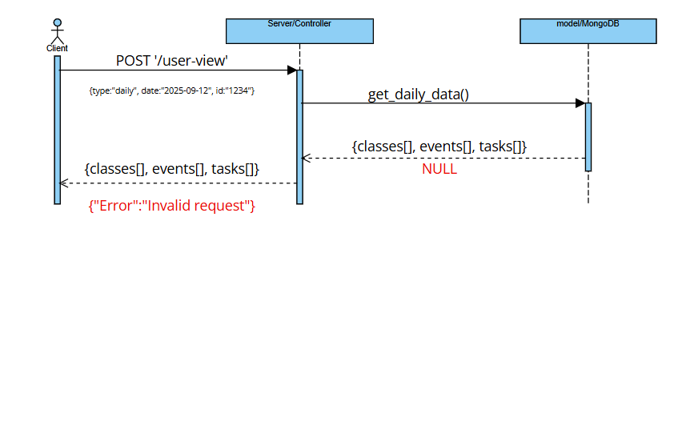

# MongoUserAPI MICROSERVICE:

A backend web service made with Node.js, Express, and the mongoose API to 
query for user data from a MongoDB database of user classes, events, and tasks.

Collaborated with a teammate using Agile and Scrum methodologies where I also wrote 
and refined user stories to capture feature requirements and define clear acceptance criteria

## GETTING STARTED:

1. download the current .zip into a directory 
2. add your mongoDB connection string to the .env file
3. run 'npm install' and then 'npm start' in the terminal

    ### HOW TO REQUEST DATA FROM API:

   #### DAILY COURSEWORK:
            endpoint: POST '/user-view'
            headers: "Content-Type": "application/json"
            body: type(str), date(str), user id(str)
            example:

                POST http://127.0.0.1:3000/user-view
                Content-Type: application/json

                {
                "type": "daily",
                "date": "2025-05-06",
                "user_id": "683b76250904b4fd6802f4d9"
                }

   #### WEEKLY COURSEWORK:
            endpoint: POST '/user-view'
            headers: "Content-Type": "application/json"
            body: type(str), date(str), user id(str)
            example:

                POST http://127.0.0.1:3000/user-view
                Content-Type: application/json

                {
                "type": "weekly",
                "date": "2025-05-06",
                "user_id": "683b76250904b4fd6802f4d9",
                "week": 1
                }

   #### MONTHLY COURSEWORK:
            endpoint: POST '/user-view'
            headers: "Content-Type": "application/json"
            body: type(str), date(str), user id(str)
            example:

                POST http://127.0.0.1:3000/user-view
                Content-Type: application/json

                {
                "type": "monthly",
                "date": "2025-05-06",
                "user_id": "683b76250904b4fd6802f4d9"
                }

    ### HOW TO RECIEVE DATA FROM API:

   #### DAILY COURSEWORK:

            SUCCESS:
                200 status code, data is a json object{} of 3 lists; 1.classes[], 2.events[], and 3.tasks[]
            FAIL:
                400 status code, "Invalid Request" message

            example:
        {
            "classes": [
                {
                "title": "Intro to computer science I",
                "location": "Learning Innovation Center",
                "room": "314",
                "class_date": "2025-05-06",
                "start_time": "22:12:00",
                "end_time": "22:12:00",
                "_id": "683b76250904b4fd6802f4da",
                "week": "1"
                }
            ],
            "events": [
                {
                "title": "event 1",
                "location": "location task",
                "date": "2025-05-06",
                "start_time": "22:12:00",
                "end_time": "22:12:00",
                "_id": "683b76250904b4fd6802f4db"
                }
            ],
            "tasks": [
                {
                "title": "assignment 1",
                "description": "read 20 pages in class textbook",
                "due_date": "2025-05-06",
                "due_time": "22:12:00",
                "_id": "683b76250904b4fd6802f4dc"
                }
            ]
        }

   #### WEEKLY COURSEWORK:

            SUCCESS:
                200 status code, data is a json object{} of 3 lists; 1.classes[], 2.events[], and 3.tasks[]
            FAIL:
                400 status code, "Invalid Request" message

   #### MONTHLY COURSEWORK:

            SUCCESS:
                200 status code, data is a json object{} of 3 lists; 1.classes[], 2.events[], and 3.tasks[]
            FAIL:
                400 status code, "Invalid Request" message

    UML DIAGRAM:
    
